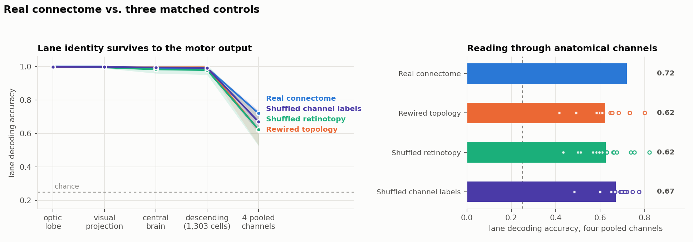
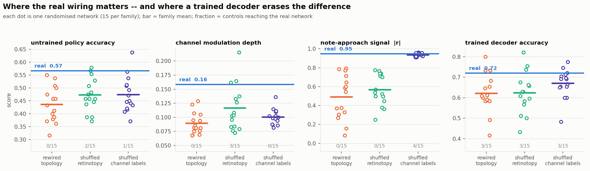
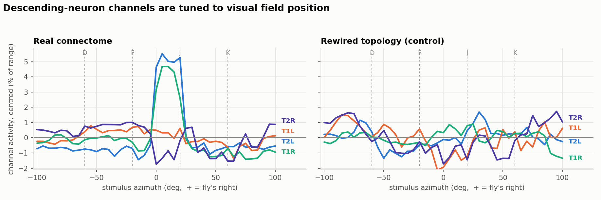
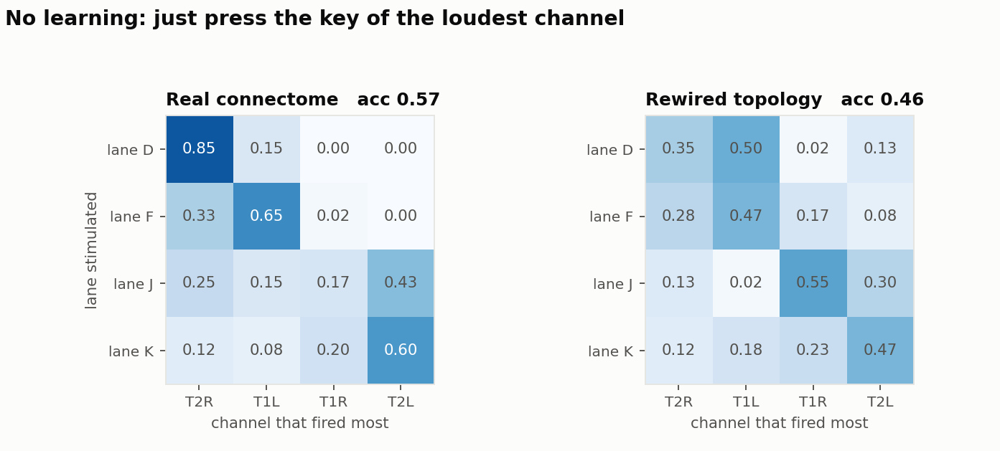
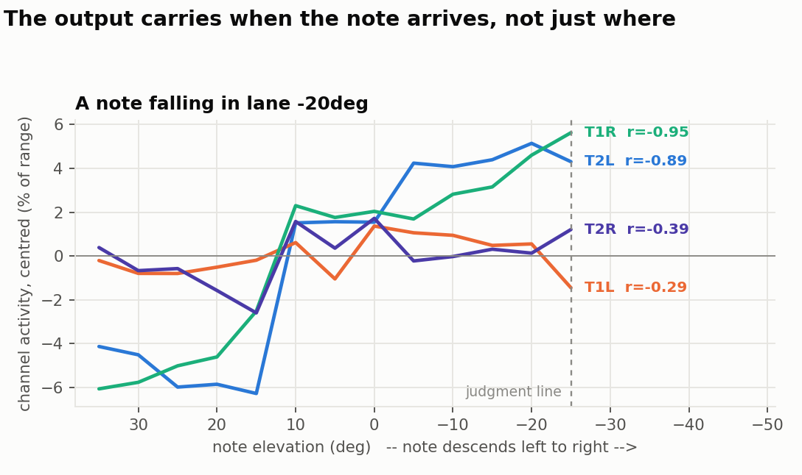

# Experiment 1 — does the fixed connectome map visual position to motor output?

**Short answer: yes, clearly. And the real wiring beats matched random wiring on
every metric that does not let a trained decoder compensate — though with 15
controls per family the best available p-value is 0.06.**

> **Read after building the game (steps 5–8):** every "settled response" below is
> the network state 300 ms after a reset to zero. The calibrated network turns
> out to be chaotic when run continuously, so these are reproducible transients
> on a chaotic trajectory, not fixed points. The real-vs-control comparisons are
> unaffected — every network got the identical protocol — but the game runs in a
> stabilised regime that differs in one documented parameter. See
> [`CALIBRATION.md`](CALIBRATION.md), "Ongoing activity", and
> [`RESULTS_E2.md`](RESULTS_E2.md), which re-runs probe B in that regime
> (real: argmax 0.567 → 0.567, 4-channel decoder 0.721 → 0.917).

Setup: 19,367 neurons and 729,558 signed synaptic connections from FlyWire v783,
on the pathway between the photoreceptors and the descending neurons. No
learning anywhere. Four lanes projected onto a cylindrical arena at azimuth
−60°, −20°, +20°, +60°; judgment line at −25° elevation. 60 trials per lane with
positional jitter (σ = 4° azimuth, 6° elevation), intensity jitter, and
photoreceptor noise. Full numbers in `results/e1_sensorimotor.json`,
`results/stats.txt`, `results/e1b_variance.json`.

## The headline

Lane decoding accuracy at each stage of the pathway, chance = 0.250:

| stage | dim | real connectome |
|---|---|---|
| optic lobe | 4,000 | 1.000 |
| visual projection neurons | 1,260 | 1.000 |
| central brain | 1,566 | 0.992 |
| **descending neurons (population)** | 1,303 | **0.992** |
| **four pooled channels** | 4 | **0.721** |
| **untrained "loudest channel" policy** | 4 | **0.567** |

Lane identity arrives essentially intact at the descending neurons. Pooling
1,303 cells into four anatomical groups costs a lot — most of the information is
in *which* cells respond, not in the group averages — but enough survives that a
policy with no learning at all, press whichever channel deviates most from its
own baseline, gets 0.567 against 0.250 chance.

## The controls

Three control families, 15 randomised networks each, matched on neuron count,
degree sequence, weight and sign multiset, calibration procedure and
channel-definition procedure:

- **rewired topology** — the graph is randomly rewired. Tests the wiring.
- **shuffled retinotopy** — same graph, each photoreceptor now sees a random
  part of the visual field. Tests the anatomical eye map.
- **shuffled channel labels** — same everything, descending neurons assigned to
  the four channels at random. Tests the output grouping.

Real vs each family; *n*/15 is how many controls reached the real network, and
p = (n+1)/16, so **0.062 is the floor** at this sample size.

| metric | real | rewired topology | shuffled retinotopy | shuffled channel labels |
|---|---|---|---|---|
| untrained policy accuracy | **0.567** | 0.437 ± 0.067 · 0/15 · p 0.062 | 0.473 ± 0.063 · 2/15 · p 0.188 | 0.474 ± 0.067 · 1/15 · p 0.125 |
| channel modulation depth | **0.159** | 0.089 ± 0.019 · 0/15 · p 0.062 | 0.116 ± 0.039 · 3/15 · p 0.250 | 0.100 ± 0.013 · 0/15 · p 0.062 |
| note-approach signal \|r\| | **0.949** | 0.489 ± 0.227 · 0/15 · p 0.062 | 0.566 ± 0.160 · 0/15 · p 0.062 | 0.935 ± 0.018 · 4/15 · p 0.312 |
| chord linearity | **0.815** | 0.738 ± 0.039 · 1/15 · p 0.125 | 0.709 ± 0.082 · 1/15 · p 0.125 | 0.815 ± 0.000 · 15/15 · p 1.000 |
| trained decoder, 4 channels | **0.721** | 0.622 ± 0.092 · 3/15 · p 0.250 | 0.624 ± 0.098 · 3/15 · p 0.250 | 0.670 ± 0.068 · 3/15 · p 0.250 |
| descending population | 0.992 | 0.996 ± 0.005 · 13/15 | 0.979 ± 0.028 · 5/15 | 0.992 ± 0.006 · 11/15 |

### Three things this table says

**1. At the population level the connectome does not matter.** A rewired network
decodes lanes just as well (0.996 vs 0.992). This is not a bug: a random
projection of an 8,452-dimensional retinal input preserves almost everything,
and a linear decoder over 1,303 cells can find it. **Information preservation
and useful structure are not the same thing** — and without the control, 0.992
would have looked like a result about the connectome.

**2. The connectome matters exactly where a learned readout cannot compensate.**
Going down the table, the gap grows as the readout gets dumber: trained decoder
over four channels, real is +1.1 SD with 3/15 controls matching it; untrained
argmax policy, +1.9 SD with 0/15; channel modulation depth, +3.7 SD with 0/15.
The freer the decoder, the less the wiring matters.

**3. The controls fail in the pattern they should.** Shuffling only the channel
labels leaves the note-approach signal intact (0.935 vs the real 0.949) and
leaves chord linearity *exactly* unchanged (0.815 vs 0.815) — both are
properties of the network, not of how its output is grouped. Rewiring or
shuffling the retinotopy halves the approach signal (0.489, 0.566). The controls
are measuring what they are supposed to measure.

## Tuning

A point source swept across azimuth. The real network produces a large, sharply
bounded, coherent response over the frontal field (roughly 0° to +20°) that no
rewired network reproduces:

This is also the honest limitation of the current lane layout: only one of the
four lanes sits in that strong frontal zone, which is part of why pooled-channel
accuracy is 0.72 rather than higher. Lane placement was fixed in advance from
the geometry of a fly's visual field, not tuned on the result.

## Without any learning

Press the key of whichever channel deviates most from its own baseline; assign
lanes to channels one-to-one:

Lanes D and F are read well (0.85, 0.65). Lanes J and K are confused with each
other, which is what you would expect from the tuning curves — both fall on the
right eye, and the channels that respond to them overlap.

## Timing

The network state is carried forward as a note descends, so this is a trajectory
rather than a sequence of independent settles. Channel activity rises
monotonically as the note approaches the judgment line, |r| up to 0.95 against
elevation:

This matters for step 8: a scoring rule needs to know not just *which* key but
*when*, and the signal is there without anything being added for it.

## Honest caveats

**The p-value floor.** With 15 controls per family the smallest achievable
p-value is 0.062. Three metrics sit at that floor against rewired topology; none
can do better without more controls. Each control costs about 3.5 minutes.

**One real connectome, many controls.** The real network's score has no error
bar in the table because there is only one of it. `experiments/e1b_variance.py`
supplies one by bootstrap: the four-channel estimate for the real network is
0.669 ± 0.031 (95% CI 0.608–0.721), so the 0.721 in the table is on the high side
of its own sampling distribution, and the same estimator gives 0.543 and 0.529
for two rewired controls. Estimation noise is σ ≈ 0.03 against an across-network
spread of 0.090, so **most of the control spread is genuine network-to-network
variation, not measurement noise** — the controls are honestly spread out, and
the real network is near but not beyond the top of them.

**The pooled test is the wrong test.** Pooling all 45 controls into one
distribution gives p = 0.087 on the best metrics, but the three families destroy
different things and pooling them answers a question nobody asked. The direct
test of "does the topology matter" is the rewired-topology column alone.

**Dynamics are assumed, not measured.** Every number here depends on the
operating-point calibration described in [`CALIBRATION.md`](CALIBRATION.md). The
calibration is label-free and identical across real and control, so it cannot
manufacture the difference between them — but it does determine the absolute
level of everything.

## What this licenses

Steps 5–8 (mania environment, encoder, controller, scoring) can be built on this
directly: the pipeline produces lane-specific, time-varying motor output from a
fixed network, with no learning.

It also sharpens step 10. The static comparison here shows the connectome
helping most where the readout is least free — which predicts that the
interesting learning experiment is not "can it learn" but **how fast, and with
how constrained a learning rule**. A reward-modulated rule that only adjusts a
small number of parameters should show a much larger real-vs-rewired gap than a
free decoder does, because a free decoder is exactly the thing that erases the
gap here.
