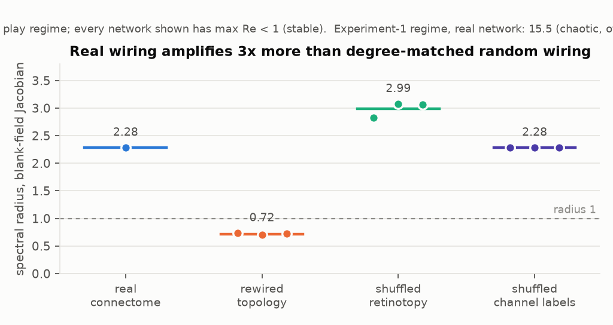
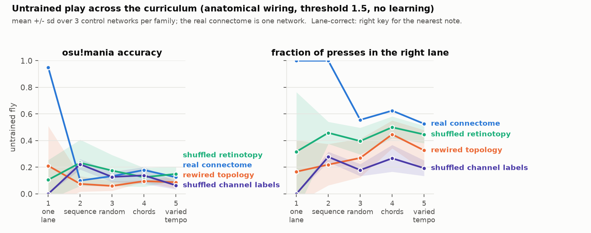
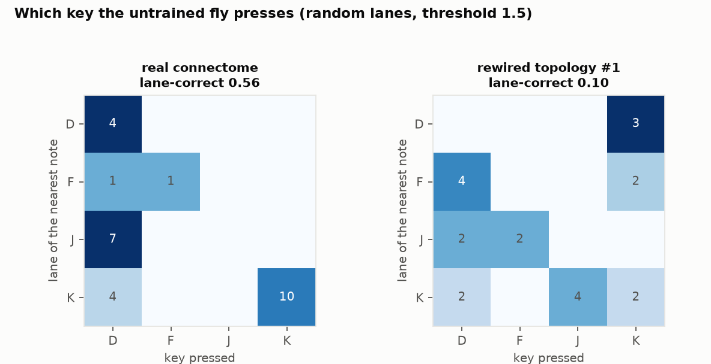
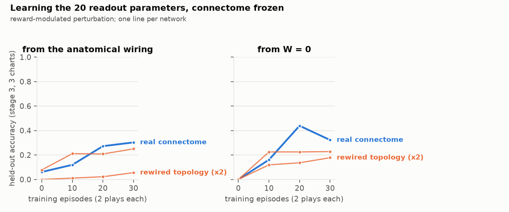

# Experiment 2 — the fly plays

**Short answer: it plays. Untrained, the real connectome hits 19 of 20 notes in
a one-lane chart (all 300s, every press 36 ms early) and presses the correct key
for the nearest note 1.0 / 1.0 / 0.56 / 0.63 / 0.53 of the time across the five
curriculum stages; no rewired, retinotopy-shuffled or channel-shuffled control
comes close on lane-correctness at any stage (0/3 controls per family reach it
in 13 of 15 cells). With 20 readout parameters learning by reward and the
connectome frozen, held-out accuracy on random charts goes 0.06 → 0.30 in 30
episodes, and 0 → 0.44 from a blank readout; the two rewired controls that were
trained reach 0.06 / 0.25 and 0.18 / 0.23. Three controls per family, so the
smallest available p is 0.25 — this is a first run, not a verdict.**

Also the most important thing learned this session, which is not in the
headline: **the experiment-1 network is chaotic when run continuously**, and the
game runs in a modified regime. Read [`CALIBRATION.md`](CALIBRATION.md),
"Ongoing activity", before anything below.

Raw numbers: `results/e2_play.json`, `results/e2.log`. Figures: `results/fig6–9`.

## Setup

Same 19,367-neuron subgraph, same lanes (azimuth −60/−20/+20/+60°), same
judgment line (−25°), same four anatomically defined channels as experiment 1.
New: notes fall continuously (800 ms spawn-to-line), the network runs without
reset at dt = 2 ms, and a controller turns the four channels into key presses.

The whole readout is 20 numbers:

```
z   = (channels − μ) / σ         μ, σ from the 61-stimulus calibration ensemble (label-free)
z_s = leaky integral of z        τ = 40 ms
u   = W z_s + b                  W 4×4, b 4
press key k when u_k crosses 0 upward; ≤ 1 press per 150 ms per key
```

Untrained: `W` is the permutation that wires each key to the channel that
responds most while one silent note falls in its lane (log₂ 24 = 4.6 bits of
stimulus knowledge, the only such input before learning), `b = −θ` with θ shared.

Scoring is osu!mania's (OD 8: 300 within ±40 ms, 50 within ±127, MISS within
±164; accuracy = weighted judgments / 300 per note). Reward for learning is
accuracy minus 0.05 per stray press per note.

Controls: the three experiment-1 families, 3 networks each, matched procedure
throughout (same regime, same normaliser, same wiring rule, same learner).

## A0. The blank field

| | real | rewired ×3 | shuffled retinotopy ×3 | shuffled channels ×3 |
|---|---|---|---|---|
| fixed point (play regime) | yes | yes | 2 of 3 | yes |
| spectral radius | **2.28** | 0.72 ± 0.01 | 2.99 ± 0.12 | 2.28 |
| experiment-1 regime, real | radius 15.5, drift 0.99 per 100 ms — chaotic | | | |



The spectral radius is a property of the graph and the calibration only. Same
graph, different eye map or different output grouping → same radius (the
retinotopy family drifts slightly because its calibration ensemble is different).
Rewire the graph with degree, weights and signs preserved → the radius drops
threefold. **The real optic lobe contains structured recurrent loops that
degree-preserving randomisation destroys**, and they put the real network near
the edge of stability where random wiring sits well inside it. This is new, it
is cheap to compute, and it is exactly the kind of connectome-specific property
the project exists to find. Retinotopy-shuffled #2 did not quite reach a fixed
point (drift 2 × 10⁻⁴ at 3 s) — it is close to the boundary at floor 30.

## A1. Experiment 1's static probe, in the play regime

30 trials per lane with jitter and photoreceptor noise, chance 0.25:

| | real | rewired | shuffled retinotopy | shuffled channels |
|---|---|---|---|---|
| untrained argmax | 0.567 | 0.550 ± 0.121 | 0.611 ± 0.039 | 0.578 ± 0.052 |
| 4-channel decoder | **0.917** | 0.758 ± 0.098 · 0/3 | 0.889 ± 0.044 | 0.964 ± 0.014 |
| descending population | 1.000 | 1.000 | 1.000 | 1.000 |

The real network's argmax accuracy is identical to experiment 1 (0.567) and its
4-channel decoder is better (0.917 vs 0.721): the play regime did not cost the
static result anything. The real-vs-rewired gap survives on the decoder (0/3),
not on the argmax at n = 3. Population decoding is at ceiling for everyone, as
in experiment 1.

## A2. Untrained play

θ = 1.5, two 20-note charts per stage, deterministic (no noise):

| stage | metric | real | rewired | shuffled retinotopy | shuffled channels |
|---|---|---|---|---|---|
| 1 one lane | accuracy | **0.950** | 0.21 ± 0.30 · 0/3 | 0.11 ± 0.15 · 0/3 | 0.00 · 0/3 |
| 1 one lane | lane-correct | **1.00** | 0.17 · 0/3 | 0.32 · 0/3 | 0.00 · 0/3 |
| 2 sequence | lane-correct | **1.00** | 0.22 · 0/3 | 0.46 · 0/3 | 0.28 · 0/3 |
| 3 random | lane-correct | **0.56** | 0.27 · 0/3 | 0.40 · 0/3 | 0.18 · 0/3 |
| 4 chords | lane-correct | **0.63** | 0.45 · 0/3 | 0.50 · 0/3 | 0.27 · 0/3 |
| 5 varied tempo | lane-correct | **0.53** | 0.33 · 1/3 | 0.45 · 1/3 | 0.19 · 0/3 |
| 2–5 | accuracy | 0.10–0.18 | 0.06–0.10 | 0.13–0.23 | 0.06–0.22 |



Two different things are being measured here and they come apart:

- **Which key.** When the untrained real fly presses, it presses the right key.
  Perfectly in stages 1–2, and 0.53–0.63 with random lanes and chords — against
  0.17–0.50 for the best control family and 0.25 chance. No control reaches the
  real network in 13 of the 15 cells. This is the experiment-1 result (lane
  identity survives to the four pooled channels) surviving contact with a
  continuously running network and a fixed threshold.
- **Whether and when.** On multi-lane charts the untrained fly misses most notes
  (hit rate 0.2–0.35): one shared threshold is right for one lane's response
  amplitude and wrong for the others, and consecutive notes in different lanes
  ride on each other's transients. Accuracy is 0.10–0.18 for everyone at stages
  2–5, which is why the accuracy panel is flat and uninformative. Timing, when
  it hits, is good: the one-lane chart is all 300s at −36 ± 0 ms.



The confusion matrix shows the specific failure: J (azimuth +20°) is never
pressed — its notes are read as D — while K is read perfectly. That is the same
J/K weakness experiment 1 found (only one lane sits in the strong frontal zone),
now with a concrete behavioural cost.

## B. Learning

Stage-3 charts (random lanes, 12 notes, 500 ms apart), one antithetic pair per
episode, σ = 0.2, lr = 1, held-out on three fresh 20-note charts every 10
episodes. Real network and rewired #1, #2.

| start | network | ep 0 | ep 10 | ep 20 | ep 30 | lane-correct 0 → 30 |
|---|---|---|---|---|---|---|
| anatomical wiring | **real** | 0.06 | 0.12 | 0.27 | **0.30** | 0.65 → **0.91** |
| | rewired #1 | 0.00 | 0.01 | 0.02 | 0.06 | 0.38 → 0.27 |
| | rewired #2 | 0.08 | 0.21 | 0.21 | 0.25 | 0.42 → 0.45 |
| W = 0 | **real** | 0.00 | 0.16 | **0.44** | 0.32 | 0 → 0.68 (0.85 at ep 20) |
| | rewired #1 | 0.00 | 0.12 | 0.14 | 0.18 | 0 → 0.24 |
| | rewired #2 | 0.00 | 0.23 | 0.23 | 0.23 | 0 → 0.44 |



What the real fly learned from the anatomical start is legible: `W` kept its
permutation structure and grew off-diagonal terms (D now reads +0.69 T1R +0.26
T1L; F reads +1.24 T2L), and the thresholds spread from a shared −2.0 to
(−1.71, −1.97, −2.20, −1.33) — a per-key gain correction, which is what the
untrained analysis said was missing. Held-out timing error went from −36 ms to
−4 ± 42 ms.

From `W = 0` the real fly found a *different* wiring (D reads T2L and T1L
positively and T1R negatively) and reached 0.44 at episode 20 before dropping
back to 0.32 — the learning rate is too high for the late phase, and there is
no annealing. Both rewired networks plateau at 0.18–0.25 from either start, and
rewired #1 barely learns at all from its anatomical wiring.

**What this does and does not show.** Two trained controls is not a
distribution. The direction is the one experiment 1 predicted — the real
wiring is worth more when the readout is small — and the size is large
(0.30 vs 0.06/0.25 and 0.44 vs 0.18/0.23), but nothing here is a p-value. The
learner's hyperparameters were chosen once on the real network's first smoke
test (σ 0.3 → 0.2) and then frozen; that is a small tuning-on-the-real-network
bias worth naming.

## Honest caveats

- **n = 3 controls per family, 2 trained.** Every p in this experiment is ≥
  0.25. The untrained lane-correct result is 0/3 in 13 of 15 cells, which is
  consistent, not significant. Each additional control costs ~10 min
  (untrained) or ~25 min (with learning) on this machine; `RESUME=1` continues
  the saved run.
- **The regime is different from experiment 1.** One parameter (`sigma_floor`
  30 vs 0.05), documented, measured in A0, and applied identically to every
  network. It reduces the calibration to per-neuron bias plus a global gain
  cap. Experiment 1's real-vs-control comparisons are unaffected — they were
  made within the old regime — but "settled response" there means "state at
  300 ms from rest" on a chaotic trajectory.
- **Untrained play is deterministic and noise-free.** The static probe uses
  experiment 1's photoreceptor noise; the play numbers do not. A noisy variant
  is one flag away (`Player(noise=0.03)`) and was not run for time.
- **Stray presses are cheap.** 0.05 per note is enough to stop key-mashing but
  lets the blank-start learner sit at 0.4–0.5 strays per note. osu!mania does
  not penalise them either.
- **The learner has no annealing** and a high learning rate; the real fly's
  0.44 → 0.32 dip is the cost. Fixing that is engineering, not science, and it
  should be fixed before anyone reads too much into a single plateau value.
- **Seeds for this run's learners were not recorded** (a `hash()` salt bug,
  fixed for future runs). The results file is complete; the learner streams
  are not reproducible bit-for-bit.
- **The lane assignment is a 4.6-bit input.** It is measured from the stimulus
  (one falling note per lane), not from reward, and it is given to the controls
  the same way. The `W = 0` learning condition exists precisely to remove it.
- **One real connectome.** Its untrained stage-1 result (0.95) is one network
  on two charts. Rewired #2 got 0.63 on the same charts — one-lane play is not
  where the difference is; the multi-lane lane-correctness is.

## What this licenses

- The pipeline is closed: connectome → eye → keys → osu! judge, real time,
  with a beatmap parser (`flyosu/beatmap.py`) and a replay driver
  (`play_osu.py`) that emits the fly's presses against the wall clock.
- The stability metric is a new, cheap, connectome-specific measurement and
  belongs in every future control comparison.
- The learning experiment is the one worth scaling: more rewired controls,
  annealed learning rate, and a threshold-only condition to separate "learn the
  timing" from "learn the mapping".
