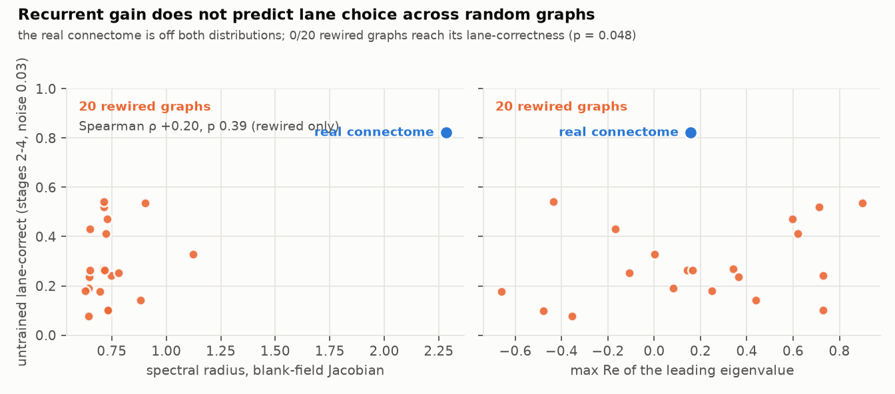

# Experiment 4 — is recurrent gain *why* the real wiring picks the right lane?

**Short answer: no. Across 20 rewired graphs, spectral radius does not predict
untrained lane-correctness (Spearman ρ = 0.20, p = 0.39), and neither does the
leading eigenvalue's real part (ρ = 0.25) or the wiring margin (ρ = −0.03). The
real connectome is exceptional on both axes — radius 2.28 against 0.74 ± 0.11,
lane-correct 0.82 against 0.29 ± 0.15 — but they are two separate facts about
it. And with 20 controls the untrained lane result clears 0.05 for the first
time in this project: 0/20 rewired graphs reach the real network, p = 0.048.**

> **Superseded in part by experiment 6.** That p = 0.048 is measured at a
> single shared threshold, θ = 1.5, which is the real network's best value and
> almost never a control's. Giving every network its own best threshold leaves
> the real one ahead but at **1/20, p = 0.095**, and the accuracy comparison
> was never below 0.1. See `docs/RESULTS_E6.md`; the correlational results on
> this page are unaffected.

Raw numbers: `results/e4_covariate.json`, `results/e4.log`. Figure 13.

## Why this was run

Experiments 2 and 3 produced two properties of the real wiring that
degree-matched random rewiring destroys: a threefold larger recurrent gain at
the blank-field fixed point, and a much better untrained mapping from lanes to
descending-neuron groups. It was natural to hope they were one property — that
the real optic lobe's recurrent loops amplify lane-specific signals and that is
*why* the four channels separate the lanes. If so, rewired graphs that happen to
have higher gain should press the right key more often. That is a correlation
across random graphs, and it is cheap to measure.

## Setup

Twenty rewired networks (seeds 1–20), each in the play regime, plus the real
connectome. Per network: `Fly.stability()` (spectral radius, max Re, fixed
point), the untrained anatomical wiring's lane-response matrix and the margin
between each lane's wired channel and the best other channel, and noisy
untrained play (θ = 1.5, photoreceptor noise 0.03) on stages 2–4, two 20-note
charts each. Lane-correct is averaged over the three stages. ~75 s per network.

## Result

| | real | rewired ×20 |
|---|---|---|
| spectral radius | **2.28** | 0.74 ± 0.11 (0.63–1.12) |
| max Re of leading eigenvalue | 0.16 | −0.66 to +0.90 |
| wired margin (z units) | 0.34 | 0.37 ± 0.24 |
| untrained lane-correct, stages 2–4 | **0.82** | 0.29 ± 0.15 (0.08–0.54) · **0/20 · p 0.048** |
| untrained accuracy | 0.14 | 0.08 ± 0.06 |

| correlation, rewired graphs only | Spearman ρ | p |
|---|---|---|
| radius vs lane-correct | +0.20 | 0.39 |
| radius vs accuracy | +0.10 | 0.68 |
| max Re vs lane-correct | +0.25 | 0.28 |
| margin vs lane-correct | −0.03 | 0.91 |
| radius vs margin | −0.13 | 0.57 |

## Reading it

**Gain and lane choice are independent across random graphs.** The rewired
graph with the highest gain (#6, radius 1.12) is middling on lane choice
(0.33); the best lane chooser (#7, 0.54) has an ordinary radius (0.90); the
worst (#12, 0.08) is not the lowest-gain graph. Twenty graphs is enough to see a
ρ of 0.5 if it were there; it is not.

**The real network is off both distributions.** Its radius is 14 standard
deviations above the rewired mean; its lane-correctness is 3.5 above. Neither
is a tail draw. But because the two are uncorrelated among random graphs,
having one does not explain having the other. Whatever makes the real optic
lobe a strong amplifier is not what makes its descending groups lane-specific.

**The wiring margin does not predict behaviour either.** The margin is how
cleanly, in z units, each lane's wired channel beats the runner-up during a
single silent falling note — the thing the untrained wiring rule optimises. The
real network's margin (0.34) is *unremarkable* among rewired graphs (0.37 ±
0.24), yet its play is far better. So the untrained advantage is not visible in
the four channels' mean response to an isolated note; it is in something the
play protocol exposes and the wiring probe does not — most plausibly the
*temporal* structure of the response (when each channel peaks relative to the
judgment line), or how the channels behave when several notes are on screen.
That is a lead for what to measure next, and a small warning about the wiring
rule: it is choosing on a quantity that does not predict success.

**Where this leaves the two facts.** The spectral radius remains a clean,
cheap, connectome-specific measurement — a property of the real graph that
randomisation destroys (experiment 3, six seeds per family). It is not a
mechanism for the behavioural result. The behavioural result stands on its own
and now has a p-value that means something.

## Honest caveats

- **p = 0.048 on one metric, chosen in advance but after two experiments had
  shown the direction.** It is a confirmatory number, not a discovery — and
  experiment 6 showed it is also threshold-dependent: at each network's own
  best threshold it is p = 0.095.
- **The shared threshold θ = 1.5 is fixed across networks.** A matched
  procedure, but 1.5 is where the real network peaks and 14 of 20 controls
  prefer 2.0 or higher (experiment 6, phase 3).
- **Twenty graphs bounds the correlation, it does not rule out a weak one.**
  With n = 20, |ρ| below about 0.4 is undetectable. The claim is "gain does not
  *explain* the behaviour", not "gain has zero effect".
- **All rewired graphs have radius < 1.2** and the real one has 2.28. If there
  is a gain effect that only appears above 2, no random graph can show it. A
  control family that preserves recurrent gain while scrambling the lane
  mapping (e.g. rewiring only the optic-lobe → central-brain projection) would
  separate the two properly.
- **Lane-correct averages stages 2–4 on two charts each** — six charts, 120
  notes, per network. Estimation noise is roughly ±0.06.
- Same regime, same noise, same wiring rule, same thresholds as experiment 3;
  rewired seeds 1–8 are the same networks as in experiments 2–3.

## What this licenses

- Report the untrained lane result with both numbers: 0/20 (p = 0.048) at the
  fixed θ these experiments used, and 1/20 (p = 0.095) when every control is
  given its own best threshold. Experiment 6 has the sweep.
- Stop describing the spectral radius as a candidate explanation for the
  behaviour. Describe it as what it is: a second, independent, connectome-
  specific property.
- Look for the untrained advantage in the *timing* of channel responses to a
  falling note, not their mean — and consider replacing the wiring rule's
  criterion with one that does predict play.
