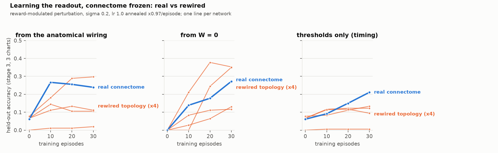
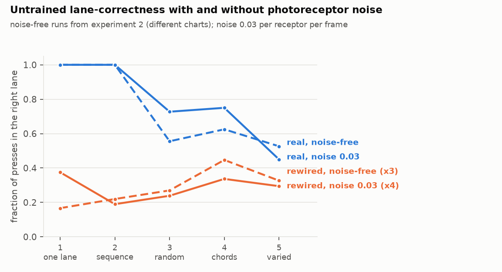
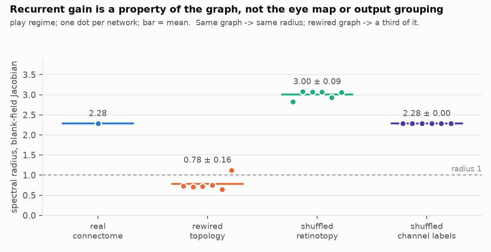

# Experiment 3 — learning, done properly; and the recurrent gain of the real wiring

**Short answer: the more constrained the learning, the more the real wiring
matters — and when the readout starts from nothing, it stops mattering.** With
the connectome frozen and 20 readout parameters learning from reward, the real
network beats all four rewired controls when only the four thresholds may move
(0.21 vs 0.09 ± 0.05, 0/4), beats three of four when it starts from its
anatomical wiring (0.24 vs 0.13 ± 0.10, 1/4), and is matched or beaten by two
of four when it starts from `W = 0` (0.27 vs 0.24 ± 0.11, 2/4). That is the
monotone ordering experiment 1 predicted, seen in a third independent protocol.
The untrained result survives photoreceptor noise (lane-correct 1.00 / 1.00 /
0.73 / 0.75 / 0.45 vs rewired 0.19–0.38; 0/4 on stages 2–4). Separately, the
blank-field spectral radius is 2.28 for the real connectome and 0.78 ± 0.16
(n = 6) for rewired networks, and it is a property of the graph alone.

Four controls, so the smallest available p is 0.20. Raw numbers in
`results/e3_learning.json`, `results/e3_stability.json`; logs alongside.

## What changed from experiment 2

- Learning rate annealed (×0.97 per episode). Experiment 2's un-annealed real
  network rose to 0.44 and fell back to 0.32; nothing here does that.
- Every learner's seed is recorded.
- Four rewired controls instead of two; each run in three conditions.
- A `thresholds-only` condition, so "learn the timing" is separated from
  "learn the mapping".
- The untrained curriculum sweep repeated with photoreceptor noise (σ 0.03 per
  receptor per frame), because experiment 2's untrained play was deterministic.
- The retina is 2.4× faster (a cached gain vector). Output bit-identical.

Everything else — regime, normaliser, wiring rule, σ = 0.2, lr = 1, stage-3
training charts, three held-out charts every 10 episodes — is as in experiment 2.

## Learning

Held-out accuracy on random-lane charts (chance for "right key" is 0.25; for
accuracy there is no chance level — a silent player scores 0):

| condition | network | ep 0 | ep 10 | ep 20 | ep 30 | lane-correct 0 → 30 | timing error |
|---|---|---|---|---|---|---|---|
| **thresholds only** | **real** | 0.06 | 0.09 | 0.15 | **0.21** | 0.65 → 0.80 | +59 ms |
| | rewired ×4 | 0.06 | 0.08 | 0.09 | 0.09 ± 0.05 | 0.40 → 0.42 | −15 to −89 ms |
| **anatomical wiring** | **real** | 0.06 | 0.27 | 0.26 | **0.24** | 0.65 → 0.85 | +10 ms |
| | rewired ×4 | 0.06 | 0.11 | 0.14 | 0.13 ± 0.10 | 0.40 → 0.43 | |
| | best rewired (#2) | 0.08 | 0.18 | 0.29 | 0.30 | 0.42 → 0.53 | +7 ms |
| **W = 0** | real | 0.00 | 0.14 | 0.18 | 0.27 | 0 → 0.82 | −21 ms |
| | rewired ×4 | 0.00 | 0.08 | 0.20 | 0.24 ± 0.11 | 0 → 0.39 | |
| | best rewired (#2, #4) | 0.00 | | 0.38 / 0.24 | 0.35 / 0.35 | 0 → 0.52 / 0.46 | |

Real vs rewired, three ways of scoring each curve:

| condition | metric | real | rewired | n ≥ real | p |
|---|---|---|---|---|---|
| thresholds only | final | 0.211 | 0.089 ± 0.050 | 0/4 | 0.20 |
| | area under curve | 0.151 | 0.086 ± 0.047 | 0/4 | 0.20 |
| anatomical wiring | final | 0.239 | 0.133 ± 0.101 | 1/4 | 0.40 |
| | area under curve | 0.254 | 0.127 ± 0.086 | 1/4 | 0.40 |
| W = 0 | final | 0.272 | 0.238 ± 0.114 | 2/4 | 0.60 |
| | area under curve | 0.196 | 0.172 ± 0.094 | 2/4 | 0.60 |

### Reading it

**Thresholds only is where the wiring shows.** When learning can only move the
four thresholds, everything about *which* key fires is fixed by the anatomical
wiring and the network's dynamics. The real network's four channels carry
enough lane-specific timing that tuning the thresholds alone triples its
accuracy (0.06 → 0.21) and pushes lane-correctness to 0.80. No rewired network
gets above 0.13; three of them do not improve at all. The real network's presses
end up 59 ms late — it learned to wait for the peak — where the rewired
networks stay 15–89 ms early.

**From the anatomical wiring, one rewired network keeps up.** Rewired #2 has a
usable anatomical wiring (lane-correct 0.42 untrained, 0.53 learned) and reaches
0.30. The other three plateau at 0.02–0.11. The real network's 0.24 is a bit
lower than experiment 2's 0.30 for the same condition — different seed,
annealed — and its curve has already flattened by episode 10.

**From `W = 0`, the wiring stops mattering.** Two rewired networks reach 0.35,
above the real network's 0.27. This is the "free decoder erases the gap" result
from experiment 1 in a new form: given a blank slate and a reward signal, a
rewired network's four channels contain about as much linearly recoverable lane
information as the real network's (experiment 1's 4-channel decoder: 3/15
controls matched the real network; experiment 2's static probe: 0.917 vs
0.758 ± 0.098). What the real wiring supplies is a *good starting point* — an
anatomical mapping from lanes to descending groups that is already 0.65
lane-correct before any reward — not a higher ceiling for a readout that learns
from scratch.

Together the three conditions say: the real connectome's contribution to this
task is in the structure a small, constrained readout can exploit without
searching for it. That is a more specific claim than "the connectome helps",
and it is the claim experiment 1 set up.

## Untrained play with photoreceptor noise

θ = 1.5, two 20-note charts per stage, σ 0.03 per receptor per frame:

| stage | real | rewired ×4 | n ≥ real |
|---|---|---|---|
| 1 one lane | **1.00** | 0.38 ± 0.42 | 1/4 |
| 2 sequence | **1.00** | 0.19 ± 0.14 | 0/4 |
| 3 random | **0.73** | 0.24 ± 0.14 | 0/4 |
| 4 chords | **0.75** | 0.34 ± 0.09 | 0/4 |
| 5 varied tempo | **0.45** | 0.29 ± 0.13 | 1/4 |

The real network's random-lane and chord scores are *higher* with noise (0.73 /
0.75) than without (0.56 / 0.63 in experiment 2). Two readings, not separable
here: the charts differ (different seeds), and noise dithers a fixed threshold
so a channel sitting just under it fires sometimes rather than never. Either
way the gap to the controls is unchanged: the untrained lane result does not
depend on the deterministic, noise-free protocol.

## The recurrent gain of the real wiring

`experiments/e3_stability.py`, six seeds per family, blank-field fixed point in
the play regime:

| family | spectral radius | fixed point | leading mode in optic lobe |
|---|---|---|---|
| real connectome | **2.28** | yes | 0.96 |
| rewired topology | 0.78 ± 0.16 (0.64–1.12) | 6/6 | 0.63–0.66 |
| shuffled retinotopy (same graph) | 3.00 ± 0.09 | 4/6 | 0.95–0.97 |
| shuffled channel labels (same network) | 2.28 ± 0.00 | 6/6 | 0.96 |

Three things this pins down beyond experiment 2's n = 3:

- The rewired distribution is wider than it first looked (one seed at 1.12) but
  its top is still less than half the real value. The real network is not a
  tail draw from the rewired distribution; it is off it.
- Same graph, different eye map: the radius moves by a third of a unit (the
  calibration ensemble differs, so the operating points differ) and the
  network sits closer to the boundary — 2 of 6 retinotopy-shuffled networks do
  not reach a fixed point at floor 30. Anyone using that family in the play
  regime should check `Fly.stability()` per network or raise the floor.
- Same network, different output grouping: identical to the digit, as it must
  be. This is also the check that caught a numerical wrinkle (below).

The leading mode lives almost entirely in the optic lobe for the real graph
(0.96) and much less so once rewired (0.64): the recurrent structure that
randomisation destroys is optic-lobe-internal.

## Honest caveats

- **n = 4 trained controls; p ≥ 0.20.** The ordering across conditions is
  the result, not any single p.
- **Rewired #1 barely learns in any condition** (0.02 / 0.13 / 0.01). Its
  anatomical wiring is poor (0.38 lane-correct) and it has the most negative
  leading eigenvalue (Re −0.69). Whether learning failure correlates with
  spectral properties across many controls is a question, not yet an answer.
- **The real network's learning curves are flat after episode 10** in two of
  three conditions. Whether that is the ceiling of a 20-parameter readout on
  four pooled channels, or the learner, is not settled. Experiment 1's trained
  4-channel decoder reached 0.72 lane accuracy on static probes, so lane
  identity is not the ceiling; timing under continuous play probably is.
- **Noise-free and noisy untrained runs used different charts**, so the
  "noise helps" observation is confounded with chart draw.
- **Bit-reproducibility.** Rewriting the retina's Gaussian as `exp(c·θ·θ)`
  changed `drive()` by 10⁻⁷ and moved the calibrated spectral radius by 2%
  (2.28 → 2.33). The original expression is restored and the affected model
  caches were rebuilt before any number here was taken. The lesson is written
  into the handoff: the model cache is keyed on parameters, not code, and the
  calibration amplifies float-level differences.

## What this licenses

- The learning story can now be stated precisely: the real connectome supplies
  a usable lane→output mapping and lane-specific timing that a constrained
  readout exploits; it does not raise the ceiling of a readout learning from
  scratch. The next experiment on this axis is a control family that keeps the
  graph but destroys the *anatomical output grouping*'s relation to the lanes —
  which the channel-shuffle family already is — run through the same three
  conditions.
- The spectral radius is ready to be used as a covariate: build 20+ rewired
  networks, measure radius and untrained lane-correctness, and ask whether
  recurrent gain predicts behaviour across random graphs.
