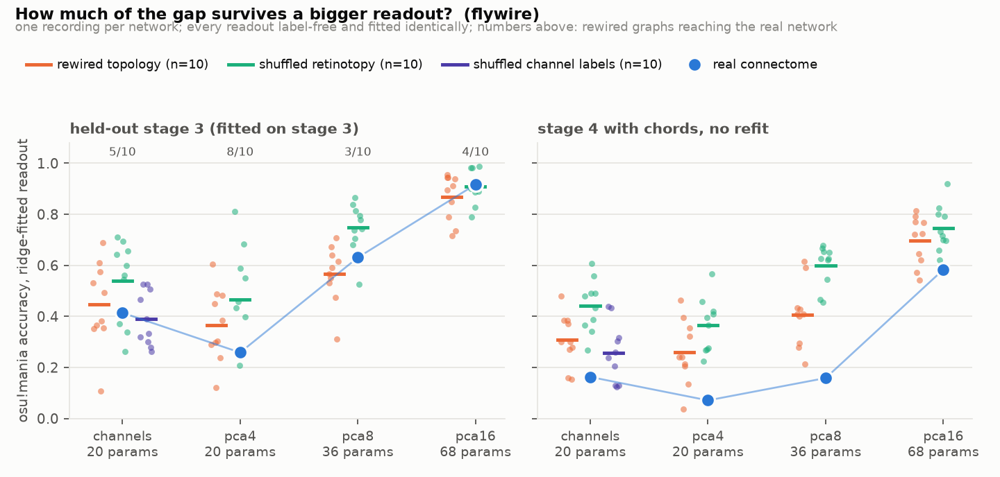
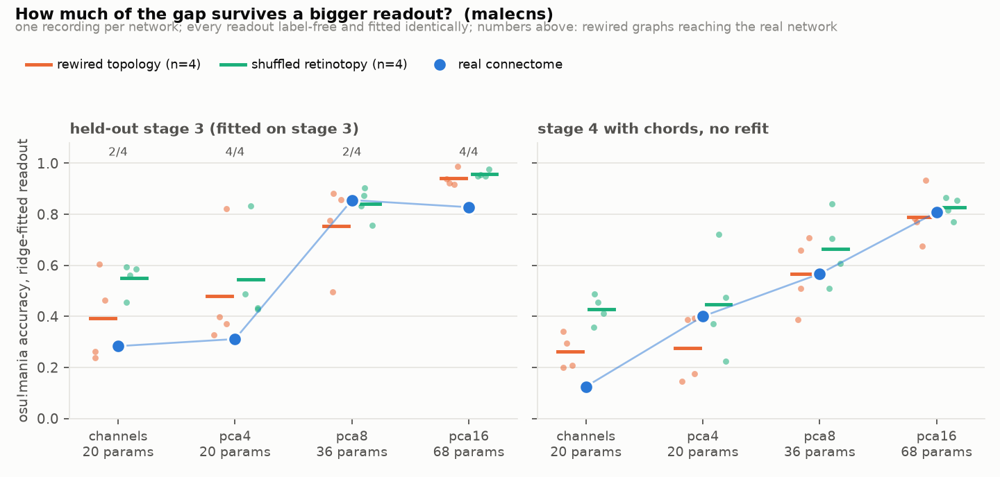

# Experiment 5 — a better method, and what it costs the comparison

**Short answer: fitting the readout in closed form triples how well the fly
plays and dissolves the connectome result. The real FlyWire network reaches
0.92 accuracy with a 68-parameter ridge readout, against 0.27 for the same
network under 30 episodes of reward-modulated perturbation — but so do the
rewired controls (0.87 ± 0.09, 4/10 reach it), and at every readout size the
real network is inside the control distribution. The gap this project has been
measuring is a gap in what a constrained, reward-driven search *finds*, not in
what the four channels *contain*. That was experiment 1's prediction; this is
the first time it has been measured in the full closed-loop game.**

The result replicates on the male CNS, with the same shape and the same
conclusion.

Raw numbers: `results/e5_reservoir.json`, `results/e5_reservoir_malecns.json`,
logs alongside. Figure 14.

## Why this was run

Every previous comparison trained the 20-parameter readout by reward-modulated
perturbation — two simulated plays per parameter update, roughly an hour per
network. That is a plausible learning rule and a terrible fitting procedure,
and it capped the project at four to eight controls per family (experiment 3)
and one metric at p = 0.048 (experiment 4).

The architecture invites a much better method. The fly is a fixed recurrent
network with a small linear readout, which is a reservoir computer; the
standard way to train a reservoir's readout is ridge regression on recorded
activity. osu!mania supplies the supervision for free, because the notes fall
whether or not the player presses: "press lane *l* now" is known from the chart
at every frame. `flyosu/reservoir.py` records the descending population once
per network while four charts fall past a silent controller, regresses the
press target on label-free features of that recording, and installs the result
in the unchanged controller. Forty seconds, not an hour.

That makes the experiment 1 question affordable for the first time: **how does
the real-vs-control gap depend on how much the readout is allowed to do?**

## Setup

One recording per network (four stage-3 charts, 24 notes each, ~31,000 frames),
then four readouts fitted from that same recording:

| readout | inputs | parameters |
|---|---|---|
| `channels` | the four anatomical channels, normalised | 4×4 + 4 = 20 |
| `pca4` | top-4 PCs of the readout population | 4×4 + 4 = 20 |
| `pca8` | top-8 PCs | 4×8 + 4 = 36 |
| `pca16` | top-16 PCs | 4×16 + 4 = 68 |

Every feature set is fitted on the same 61-stimulus calibration ensemble the
network was calibrated on, and none of them sees a lane or a key. `channels`
and `pca4` have the *same parameter count*, so the difference between them is
what the anatomical grouping is worth against a data-driven basis of the same
size. Each readout is evaluated on three held-out stage-3 charts (the seeds
experiment 3 used) and, without refitting, on two stage-4 charts with chords.

Controls: rewired topology, shuffled retinotopy, shuffled channel labels (×10
each on FlyWire; ×4 rewired and ×4 retinotopy on the male CNS). The channel
shuffle only changes the anatomical grouping, so only the `channels` readout
is fitted for that family.

## Result — FlyWire

Held-out stage-3 accuracy:

| readout | real | rewired ×10 | shuffled retinotopy ×10 | shuffled channels ×10 |
|---|---|---|---|---|
| channels (20) | 0.414 | 0.446 ± 0.159 · **5/10** | 0.538 ± 0.151 · 7/10 | 0.390 ± 0.101 · 4/10 |
| pca4 (20) | 0.258 | 0.366 ± 0.136 · 8/10 | 0.467 ± 0.184 · 9/10 | — |
| pca8 (36) | **0.631** | 0.566 ± 0.107 · **3/10** | 0.749 ± 0.093 · 9/10 | — |
| pca16 (68) | **0.917** | 0.868 ± 0.086 · 4/10 | 0.910 ± 0.063 · 5/10 | — |

Stage 4 (chords), same readouts, no refitting: real 0.162 / 0.071 / 0.158 /
0.583 against rewired 0.308 / 0.260 / 0.408 / 0.697.

## Result — male CNS

Same protocol, 348 leg motor neurons as the readout population:

| readout | real | rewired ×4 | shuffled retinotopy ×4 |
|---|---|---|---|
| channels (20) | 0.283 | 0.392 ± 0.151 · 2/4 | 0.549 ± 0.055 · 4/4 |
| pca4 (20) | 0.311 | 0.480 ± 0.199 · 4/4 | 0.546 ± 0.168 · 4/4 |
| pca8 (36) | **0.856** | 0.753 ± 0.153 · 2/4 | 0.841 ± 0.055 · 2/4 |
| pca16 (68) | 0.828 | 0.942 ± 0.028 · 4/4 | 0.958 ± 0.011 · 4/4 |

The male CNS's four *real leg motor pools* still cannot play (0.28 with the
`channels` readout, lane-correct 0.57) — the common-mode result from
`docs/MALECNS.md` survives a supervised fit, which is the strongest version of
that finding. But eight components of the same 348 neurons reach 0.86. The
information is there; the anatomical pooling by (neuromere, side) is what
throws it away.

## Reading it

**The method is much better at the task.** Real FlyWire network, held-out
stage-3 accuracy: 0.23 untrained, 0.27 after 30 episodes of perturbation
(experiment 3, ~1 h), 0.41 with the same 20 parameters fitted in closed form
(40 s), 0.92 with 68. The fly plays osu!mania far better than anything
previously reported in this project, and the connectome is still frozen.

**And it erases the connectome result.** At no readout size is the real network
outside the rewired distribution — the best it does is 3/10 at `pca8`, p =
0.36. Compare experiment 3's reward-trained numbers on the same networks and
the same held-out charts: 0/8 rewired controls reached the real network when
only the thresholds could move, 1/8 from the anatomical wiring. Same networks,
same game, same parameter budget; the difference is entirely in how the 20
numbers were chosen.

The two results are consistent, and together they are more informative than
either alone: **the lane information is in every network, and what distinguishes
the real one is that a constrained search finds it.** Experiment 1 saw this
with an offline decoder ("a free decoder erases the gap"); experiment 3 saw the
ordering (the more constrained the learning, the larger the gap); this measures
the same thing in closed-loop play, with a supervised ceiling in place of the
free decoder. A connectome's contribution to behaviour, in this model, is about
the *accessibility* of task-relevant structure to a plausible learning rule —
not about whether the structure exists.

**Anatomical grouping beats a variance-ordered basis at equal size — sometimes.**
`channels` (0.414) beats `pca4` (0.258) on the real FlyWire network with the
same 20 parameters, and the gap is the other way on most controls. But the
honest reading of the `pca4` column is different: for the real network the top
four PCs are *dominated by the common mode*, which carries no lane information.
The real network's descending population is far more low-dimensional than any
rewired one's (PC1 alone: 0.38 vs 0.11–0.17 of ensemble variance; top-4: 0.82
vs 0.35–0.46; on the male CNS, PC1 0.63 and top-4 0.98 vs 0.39–0.67). Strong
recurrent amplification makes the population move together, so a
variance-ordered basis spends its first components on that shared motion.
Lane identity lives in components 5–16, which is why `pca8` and `pca16` jump.
**Variance ordering is not information ordering**, and any label-free readout
that truncates by variance will trip over this on a real connectome long before
it does on a random one.

**Low dimensionality is a third connectome-specific property.** It is measured
on the same calibration ensemble as everything else, it separates real from
rewired as cleanly as the spectral radius does, and it replicates across the two
datasets. Whether it is *the same* property as the high spectral radius is
untested; the retinotopy-shuffled family (same graph, radius 2.7–3.3, PC1
0.23–0.58) suggests they are related but not identical.

**Stage-4 transfer is where the real network looks worst.** Fitted on stage 3
and asked to play chords without refitting, the real network scores below the
rewired mean at three of four readout sizes. Chords put two notes on screen at
once; the real network's amplified common mode presumably responds to both
lanes together. This is a concrete, cheap follow-up: fit on stage 4 and see
whether the ordering changes.

## Honest caveats

- **A ridge fit is a supervised ceiling, not a learning rule.** It uses the
  chart's note times as a per-frame target. No fly has that. `learn.py`
  remains the plausible rule, and its numbers remain the ones that bear on
  "could a fly learn this".
- **Every p here is ≥ 0.36 — this is a negative result, and it is reported as
  one.** Ten controls per family can detect a gap the size of experiment 3's;
  it is not there.
- **The readout sizes are not matched in expressiveness to experiment 3's.**
  `channels` is the same 20 parameters on the same inputs, so that row is a
  like-for-like comparison with experiment 3; `pca8` and `pca16` are strictly
  more readout than any previous experiment allowed.
- **The threshold search sees the training charts.** Per lane, the window
  position (6 values) and threshold offset (41 values) are chosen by replaying
  the crossing rule through the judge on the four training recordings, which is
  8 more fitted numbers than the ridge weights suggest and a mild optimistic
  bias on training reward. Held-out charts are never touched, and every network
  gets the identical search.
- **The fit's stray-press penalty (0.4 per stray per note) is a modelling
  choice, not osu!'s.** osu!mania charges nothing for pressing an empty lane,
  so with the learner's 0.05 penalty the search found the degenerate strategy —
  fire all four lanes at every note, accuracy 1.0 — and the first run of this
  experiment reported it before it was caught. Accuracy, hit rate, strays and
  lane-correctness are all reported separately so that a repeat of this is
  visible.
- **One recording per network, four charts, at a fixed noise level (0.03).**
  Estimation noise on held-out accuracy is roughly ±0.05 (three charts,
  60 notes).
- **Male CNS controls are n = 4**, and its retinotopy is a geometric
  reconstruction (`docs/MALECNS.md`), not a measured eye map.

## What this licenses

- Report the project's best osu!mania performance as **0.92 accuracy on
  held-out stage-3 charts with a 68-parameter readout** — and say in the same
  sentence that rewired controls do as well.
- Stop describing the real-vs-random gap as being about what the connectome
  makes available. It is about what a small reward-driven search can reach.
- Use the ridge fit as the *instrument* it is: cheap enough to sweep readout
  size, control family, dataset and chart difficulty, and to establish the
  ceiling any learning rule is working against.
- Add population dimensionality to the list of connectome-specific measurements
  (with spectral radius), and treat "variance ordering ≠ information ordering"
  as a standing warning for label-free readouts on real connectomes.
