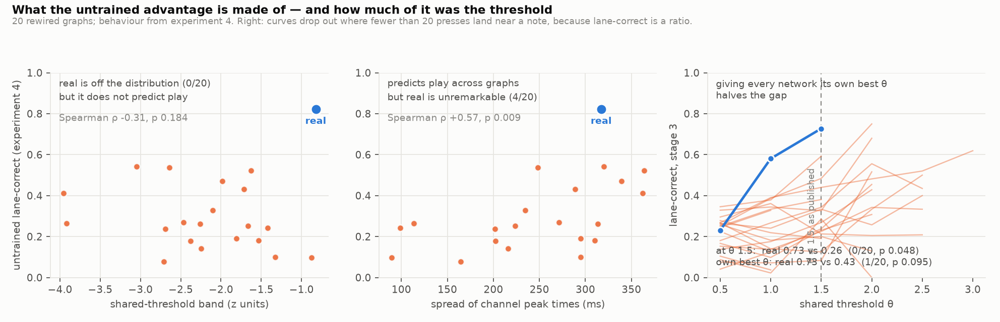

# Experiment 6 — where the untrained advantage lives, and a correction to its p-value

**Short answer, in three parts.**

**(1)** The untrained advantage is a *shared-threshold* phenomenon. The real
connectome is the only network of 21 whose four channels admit a single
threshold that fires each key on its own lane and not on the others (band
−0.82 z against −2.22 ± 0.78, **0/20**), and the only one whose right channel
leads for most of the hit window (0.79 against 0.48 ± 0.14, **0/20**). Neither
quantity predicts play *among* the controls.

> **Partly retracted by experiment 7.** The band was measured with every
> network wired by the *margin* rule, which does not optimise it. Give each
> network the wiring that does and 5 of 20 rewired graphs match or beat the
> real network's band (−1.73 ± 0.85, p = 0.286). The real network has one of
> the widest bands and is one of the few networks where the naive rule finds
> it — it is not alone in having one. The selectivity result (0/20) is measured
> under the same wiring and has not been re-tested. See
> `docs/RESULTS_E7.md`.

**(2)** What predicts play among the controls is something else entirely: how
*spread out* the four channels' peak times are (ρ = +0.57, p = 0.009) and how
many lanes cross threshold while a press would still be judged (ρ = +0.47,
p = 0.036). The real network is unremarkable on the first (4/20 above it).
With 13 predictors tested, neither survives a multiple-comparison correction.

**(3)** And the correction. Experiments 2–4 reported untrained play at a single
shared threshold, θ = 1.5, for every network. That is a matched procedure but
not a matched outcome: 1.5 is the real network's best value and almost never a
control's (14 of 20 prefer 2.0 or higher). Sweeping θ and giving **every
network its own best** halves the gap and takes it out of significance: real
0.73 vs rewired 0.26 ± 0.14 (0/20, p = 0.048) becomes real 0.73 vs 0.43 ± 0.15
(**1/20, p = 0.095**). On accuracy rather than lane-correctness the comparison
was never significant: 0.146 vs 0.075 (2/20, p = 0.143) at θ = 1.5, and 0.196
vs 0.148 (5/20, p = 0.286) at each network's best.

Raw numbers: `results/e6_timing.json`; logs `e6.log`, `e6b.log`, `e6c.log`.
Figure 15.

## Why this was run

Experiment 4 measured untrained play on the real connectome and 20 rewired
graphs, found the real network far ahead, and then found that none of its
candidate explanations predicted play across those graphs — not the spectral
radius (ρ = 0.20), not the leading eigenvalue, and not the wiring margin
(ρ = −0.03). So the advantage was in something the play protocol exposes and
the probe did not.

`flyosu/probes.py` measures what the untrained policy actually depends on,
time-resolved and past the judgment line (experiment 4's probe stopped at it).
The behavioural numbers are experiment 4's own, unchanged, so nothing here
re-measures the thing being predicted.

## The one that mattered: a single threshold for four keys

`Controller.anatomical` sets `b = -θ` for **every** key. For that policy to
work it is not enough that each lane's channel prefers its own lane; all four
channels must clear the *same* θ during their own lane and stay under it during
the other three. Four perfectly selective channels at four different scales
fail this, and a margin measured lane by lane — which is what experiment 4
measured — cannot see it.

| quantity | real | rewired ×20 | n ≥ real | ρ vs play | p |
|---|---|---|---|---|---|
| shared-threshold band (z) | **−0.82** | −2.22 ± 0.78 | **0/20** | −0.31 | 0.18 |
| selectivity (argmax fraction) | **0.79** | 0.48 ± 0.14 | **0/20** | +0.18 | 0.44 |
| worst-key margin (z) | −0.69 | −1.55 ± 0.89 | 4/20 | −0.12 | 0.61 |
| keys falsely driven | **1** | 3.25 ± 1.61 | 3/20 | −0.08 | 0.72 |
| peak-time spread (ms) | 317 | 248 ± 82 | 4/20 | **+0.57** | **0.009** |
| lanes crossing on time | **1** | 0.25 ± 0.43 | 5/20 | **+0.47** | **0.036** |
| chord response change (z) | −0.12 | +0.24 ± 0.29 | 17/20 | −0.17 | 0.46 |

Two observations that cost nothing and explain a lot:

**Every network's channels peak long before the note arrives** — 200 to 600 ms
early, on all 21. The note is visible from spawn and the response is dominated
by its onset, while osu!mania's windows are tens of milliseconds wide. Only one
of the real network's four lanes crosses threshold inside the window where a
press is judged rather than being a stray, and the rewired mean is 0.25 of 4.
This is a property of the *encoder and the game*, not of any connectome, and it
caps what any threshold policy on these channels can score.

**Staggered peaks help; synchronised peaks hurt.** The strongest correlate of
play across random graphs is the *spread* of the four channels' peak times, and
the sign is positive. With one shared threshold, four channels that peak
together cross together and press all four keys at once; four channels that
peak at different times let the right key win alone. That is a mechanism, not
just a correlation, and it is the one thing here that a successor could design
a wiring rule around.

## The causal test: replacing the shared threshold

If the advantage is that *one* threshold serves the real network's four keys,
then handing every network four per-key thresholds should help the controls and
not the real one. Each key's threshold was set halfway between its own hit peak
and its worst false alarm, from the same silent probe.

| | one shared θ = 1.5 | four per-key θ from the probe |
|---|---|---|
| real | **0.82** | 0.43 (−0.39) |
| rewired ×20 | 0.29 ± 0.15 | 0.30 ± 0.12 (+0.02) |
| controls reaching real | 0/20 · p 0.048 | 4/20 · p 0.238 |

The real network loses almost half its lane-correctness; the controls do not
move. The direction is as predicted but the reason is narrower than "per-key
thresholds are bad": the probe's midpoints are *lower* than 1.5 for every key
(0.69–1.34), and the real network's advantage depends on a threshold high
enough to reject the big early onset response. Lower it and the network fires
on the onset, in the wrong lane, before the note arrives.

Per-key thresholds are not the problem — experiment 3 *learned* four thresholds
from reward and the real network still beat every control (0/8). Thresholds set
from an isolated-note probe are the problem, because an isolated note is not
what the network sees during play.

## The correction: how much of the gap was the threshold?

Experiment 2 tried θ ∈ {1.5, 2.0} on every network and reported 1.5;
experiments 3 and 4 then fixed 1.5. Each network's behaviour is a curve in θ,
and those curves peak in different places.

| stage 3, lane-correct | real | rewired ×20 | n ≥ real | p |
|---|---|---|---|---|
| at θ = 1.5 (as published) | 0.73 | 0.26 ± 0.14 | 0/20 | **0.048** |
| each at its own best θ | 0.73 (θ = 1.5) | 0.43 ± 0.15 | 1/20 | **0.095** |

| stage 3, accuracy | real | rewired ×20 | n ≥ real | p |
|---|---|---|---|---|
| at θ = 1.5 | 0.146 | 0.075 ± 0.069 | 2/20 | 0.143 |
| each at its own best θ | 0.196 | 0.148 ± 0.076 | 5/20 | 0.286 |

The real network gains nothing from the sweep — 1.5 already was its best. The
controls gain 0.17 on average, because 14 of 20 prefer a higher threshold.
Roughly a third of the published untrained gap was the threshold sitting where
the real network likes it.

**What survives.** The real network is still the best of 21 under the most
generous control the protocol admits, on both metrics, and it is still the only
one that does not need its threshold tuned. What does not survive is the
p-value: the project's only sub-0.05 result is p = 0.095 when every control is
given its own best operating point, and the accuracy comparison was never
below 0.1.

**A metric caveat found on the way.** Lane-correctness is a ratio over presses
that landed near a note, so a network that presses twice and gets both right
scores 1.00. The sweep hit this repeatedly at high θ (rewired #1 scores 1.00 on
2 presses; #10 on 1). Thresholds producing fewer than 20 counted presses over
40 notes are excluded above. **Experiment 4's p = 0.048 is not affected** —
every network there counted 45 to 237 presses over 120 notes — but any future
use of this metric needs the guard.

## Honest caveats

- **Thirteen predictors, two below 0.05.** Bonferroni puts them at 0.12 and
  0.47. The peak-spread result is reported because it has a mechanism, not
  because of its p-value.
- **The correlations are on rewired graphs only** (n = 20), so |ρ| below about
  0.4 is undetectable, and the real network is excluded from the fit by
  construction — it is off the distribution on two of the predictors.
- **The θ sweep is six values on stage 3 with two charts** (40 notes), and
  estimation noise on lane-correct at that size is roughly ±0.08. A finer
  sweep on more charts would sharpen the comparison; it would not change the
  direction.
- **"Its own best θ" is an optimistic bound for the controls**, chosen on the
  same charts it is scored on. The honest reading is that it brackets the
  gap from the generous side, as θ = 1.5 bracketed it from the favourable one.
- Probes are silent, noise-free and single-note; play is noisy and continuous.
  That mismatch is exactly what broke the per-key thresholds, and it applies to
  every probe-derived number here.

## What this licenses

- Report the untrained result as **real 0.73 vs rewired 0.43 ± 0.15, 1/20,
  p = 0.095** when a reviewer asks for the strongest control, and as p = 0.048
  at the fixed θ the earlier experiments used — with the difference stated.
  Do not cite 0.048 alone any more.
- Describe the real network's distinguishing property precisely, and note that
  experiment 7 narrowed it: it has one of the widest shared-threshold bands, it
  is one of six networks of 21 where the naive wiring rule happens to find that
  band, and it is the one network that needs no threshold tuning.
- Treat the spread of channel peak times as the most promising design variable
  for a better wiring rule, and stop using mean response margins for that job.
- Add a press-count guard wherever lane-correctness is used.
