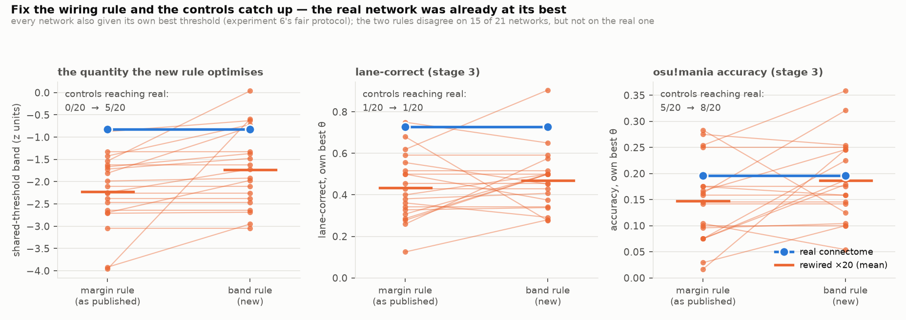

# Experiment 7 — fix the wiring rule, and watch the last of the gap go

**Short answer: the new rule works, it helps only the controls, and it retracts
experiment 6's central claim. Choosing the lane-to-channel wiring by the
shared-threshold band instead of the summed mean response widens that band by
0.46 z on average and changes the choice on 15 of 21 networks — but not on the
real connectome, which was already at its optimum under the old rule. So every
control improves and the real network does not. Under the fairest protocol this
project has run (best wiring rule, and every network at its own best threshold)
the untrained accuracy advantage is gone — real 0.196 vs rewired 0.186 ± 0.075,
**8/20, p = 0.43** — and lane-correctness is real 0.73 vs 0.47 ± 0.14,
**1/20, p = 0.095**.**

**And the retraction.** Experiment 6 reported that the real network is the only
one of 21 admitting a single threshold for all four keys (band −0.82 against
−2.22 ± 0.78, 0/20). That was measured with each network wired by the *margin*
rule, which does not optimise the band. Give each network the wiring that does,
and **5 of 20 rewired graphs match or beat the real network's band**
(−1.73 ± 0.85, p = 0.286). The real network still has a wide band; it is no
longer alone in having one.

Experiment 6 reported a second quantity at 0/20 on the same wiring — channel
*selectivity* — and it was owed the same test. It **mostly survives**: real
0.79 against 0.50 ± 0.17, **1/20, p = 0.095**. The two claims come apart under
the corrected wiring, and selectivity is the durable one.

Raw numbers: `results/e7_wiring.json`, `results/e7.log`. Figure 16.

## Why this was run

Experiment 4 showed the untrained wiring rule optimises a quantity that does
not predict play (summed mean response; ρ = −0.03 across rewired graphs).
Experiment 6 found one that did discriminate — the width of the band of
thresholds serving all four keys — with a mechanism behind it, since the policy
really does use one threshold for four keys. The obvious move is to swap the
criterion and see what happens.

Nothing else changes. Both rules pick one of the same 24 lane-to-channel
permutations from the same silent single-note probe (log₂24 = 4.6 bits of
stimulus knowledge, declared as always); the controller, the encoder and the
network are untouched. Every network is then swept over θ ∈ {0.5 … 3.0} and
scored at its own best, which is experiment 6's fair protocol, so no network is
handed a threshold that suits another.

## Result

| | margin rule (as published) | band rule (new) |
|---|---|---|
| shared-threshold band, real | −0.82 | −0.82 (unchanged) |
| shared-threshold band, rewired ×20 | −2.22 ± 0.78 · 0/20 | −1.73 ± 0.85 · **5/20** |
| lane-correct, real | 0.727 | 0.727 (unchanged) |
| lane-correct, rewired ×20 | 0.433 ± 0.153 · 1/20 · p 0.095 | 0.469 ± 0.143 · 1/20 · p 0.095 |
| accuracy, real | 0.196 | 0.196 (unchanged) |
| accuracy, rewired ×20 | 0.148 ± 0.076 · 5/20 · p 0.286 | 0.186 ± 0.075 · **8/20 · p 0.43** |

The two rules disagree on 15 of 21 networks. They agree on the real one — and
on five controls, so agreement is not unique to the real connectome, just
uncommon.

## Reading it

**The real network was already at the optimum of a criterion nobody was
optimising.** The margin rule picks the band-best permutation for the real
connectome by coincidence, and for only five of twenty rewired graphs. Every
previous experiment applied that rule to all networks and called it matched. It
was matched as a *procedure* and unmatched in *outcome*, in the real network's
favour — the same shape of problem as the fixed θ = 1.5 that experiment 6
found. Two independent procedural choices, both innocuous-looking, both
quietly favouring the network they were developed on.

**Fixing it helps controls by about +0.04 on both metrics and the real network
by nothing.** Nine of twenty controls improve their lane-correctness (rewired
#3: 0.62 → 0.90; #18: 0.26 → 0.58), six get worse, five are unchanged. The mean
moves up, and on accuracy the control distribution now straddles the real
network.

**The untrained accuracy advantage is gone.** 8/20 controls reach or beat the
real network, p = 0.43. What remains is lane-correctness at 1/20, p = 0.095 —
the same as experiment 6 reported, because neither the real network nor the
single control that beats it changed. Lane-correctness measures *which* key is
pressed among presses that landed near a note; accuracy measures whether the
fly is actually playing the game. The surviving claim is on the first, not the
second.

**Experiment 6's band result does not survive its own follow-up.** The band
looked like the real network's unique structural property because it was
measured under a wiring rule that was not choosing for it. Measured with each
network given its best shot, a quarter of the controls match it. This is the
third time in three experiments that a gap shrank when the controls were given
a fairer procedure (experiment 5: readout fitting; experiment 6: threshold;
experiment 7: wiring rule), and the pattern is now the most robust finding in
the project.

## Does the other experiment-6 claim survive?

The band was one of two quantities on which experiment 6 put the real network
at 0/20. The other was selectivity — the fraction of the hit window the wired
channel spends as the largest of the four. Re-measured with every network given
its band-optimal wiring (`PHASE=selectivity`, probes only, no play):

| quantity | margin wiring | band wiring | verdict |
|---|---|---|---|
| shared-threshold band | real −0.82 vs −2.22 ± 0.78 · 0/20 · p 0.048 | −0.82 vs −1.73 ± 0.85 · **5/20** · p 0.286 | retracted |
| selectivity | real 0.79 vs 0.48 ± 0.14 · 0/20 · p 0.048 | 0.79 vs 0.50 ± 0.17 · **1/20** · p 0.095 | survives in direction |
| peak margin | real 1.00 vs 0.54 ± 0.39 · 2/20 · p 0.143 | 1.00 vs 0.49 ± 0.64 · 5/20 · p 0.286 | weakened |
| keys falsely driven | real 1 vs 3.25 ± 1.61 · 3/20 · p 0.190 | 1 vs 3.55 ± 1.63 · 3/20 · p 0.190 | unchanged |

The new wiring rule barely moves the controls' selectivity on average (+0.017)
but scatters it (sd 0.14 → 0.17): six controls improve, nine get worse, because
the rule optimises the band and selectivity is a different quantity. The single
control that reaches the real network is rewired #8, which jumps from 0.29 to
0.87 — one graph for which the band-optimal wiring happens to be far more
selective than the margin-optimal one.

So the two claims are not equivalent, and the band was the fragile one. What
the real connectome has that survives every correction so far is that **its
four channels are unusually lane-selective**, at p = 0.095.

## What is left standing

- **Spectral radius.** Real 2.28 vs rewired 0.78 ± 0.16, replicated on the male
  CNS (2.05 vs 0.64–0.72). A property of the graph, measured without any
  behavioural protocol, so none of these procedural corrections touch it.
- **Population dimensionality.** Real PC1 0.38 of ensemble variance vs
  0.11–0.17 rewired; male CNS 0.63 vs 0.13–0.28. Same standing as the radius.
- **Untrained lane-correctness, 1/20, p = 0.095**, under the best protocol
  available. Direction consistent across every version of the comparison,
  significance not reached.
- **Channel selectivity, 1/20, p = 0.095**, re-measured under the corrected
  wiring rule.
- **Untrained accuracy: no advantage** (8/20, p = 0.43).
- **The supervised ceiling shows no advantage at any readout size**
  (experiment 5).

## Honest caveats

- **"Own best θ" and "own best wiring" are optimistic for the controls**, both
  chosen on the charts they are scored on. Together they bracket the gap from
  the generous side, as the fixed θ and the margin rule bracketed it from the
  favourable one. The truth is between; this page reports both ends.
- **Stage 3 only, two 20-note charts**, so ±0.08 estimation noise on
  lane-correct and ±0.04 on accuracy. The band rule's +0.04 on accuracy is
  about one standard error of a single network's estimate; the paired
  comparison across 20 networks is what carries it, not any one row.
- **The band is measured on a silent, noise-free, single-note probe** and the
  play it predicts is noisy and continuous. Experiment 6 already showed that
  mismatch breaking per-key thresholds.
- **Nothing here re-runs experiments 2 and 3.** Their learned-readout numbers
  were measured with the margin rule and a fixed θ, so the same correction
  presumably applies to their untrained starting points. The learning curves
  themselves start from `W = 0` in one of three conditions, which is immune.

## What this licenses

- Use `probes.band_assignment` as the untrained wiring rule from here on; it
  optimises a quantity with a mechanism, and it is strictly better on its own
  criterion.
- Report untrained play as **lane-correct 1/20 (p = 0.095), accuracy 8/20
  (p = 0.43)**, with the protocol stated. Do not cite the 0/20 numbers without
  saying they come from a fixed threshold and a wiring rule that was not
  optimising the quantity that matters.
- Retract "the real network is the only one that admits a single working
  threshold" (experiment 6). Replace with: it has one of the widest bands, and
  it is one of the few networks where the naive rule finds it.
- Keep the selectivity claim, at p = 0.095 rather than 0.048. It is the one
  probe-level property that survived being re-measured under a rule chosen to
  help the controls.
- Treat "a gap that shrinks whenever the controls are given a fairer
  procedure" as the project's main methodological result, and design the next
  experiment to be adversarial to the real network from the start.
